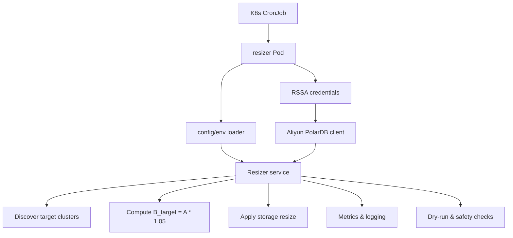

## 目标与范围

- **目标**: 实现一个在 Kubernetes 中按日运行的 Python CronJob，按 README 中的策略为 **包年包月 PolarDB 实例** 自动调整预置存储大小，并满足生产级要求：多 Region、可扩展到多账号、可观测、可配置、可安全回滚。
- **范围**:
  - 单云账号起步，支持多 Region；后续可通过配置扩展多账号。
  - 使用 RSSA（ServiceAccount 绑定 RAM 角色）获取访问 PolarDB 的临时凭证。
  - 严格遵守 **/parallel-dev**：先测后码（RED → GREEN → REFACTOR），测试和实现可并行推进但顺序上必须先定义测试。

## 高层架构




- **代码形态**（建议）：
  - 核心代码放在 `[src/polardb_storage_resizer](src/polardb_storage_resizer)`
  - 测试放在 `[tests](tests)`
  - 测试数据固件放在 `[tests/fixtures](tests/fixtures)`
  - K8s 清单放在 `[k8s](k8s)`
  - 设计与实现文档放在 `[docs](docs)`
- **核心文件结构**：
  ```text
  src/polardb_storage_resizer/
  ├── __init__.py
  ├── models.py              # 共享数据模型（ClusterSummary, ClusterDetail, ChangePlan 等）
  ├── errors.py              # 统一错误类型定义
  ├── redaction.py           # 敏感信息脱敏工具（含 redact_error_message）
  ├── config.py              # 配置加载与验证
  ├── cloud_client.py        # 云 API 抽象层（typing.Protocol 接口）
  ├── strategy.py            # 存储调整策略与 API 约束验证
  ├── executor.py            # 执行器与并发控制
  ├── logging_setup.py       # 日志配置
  ├── metrics.py             # 指标收集
  └── main.py                # CLI 入口与主流程
  tests/
  ├── conftest.py            # 共享 fixture、环境隔离、fake client 工厂
  ```

## 组件设计

### 0. 错误类型与测试固件（基础层）

- **目标**: 在实现其他组件前，先定义统一的错误类型体系、敏感信息脱敏工具和测试数据固件。
- **计划**:
  - 在 `[src/polardb_storage_resizer/errors.py](src/polardb_storage_resizer/errors.py)` 中定义错误层级：
    - `ResizerError`: 基础异常类
    - `CloudAPIError`: 云 API 调用失败（基类）
      - `TransientCloudAPIError`: 可重试错误（网络超时、5xx、限流等）
      - `PermanentCloudAPIError`: 不可重试错误（4xx、权限拒绝、参数校验等）
    - `ValidationError`: 配置或输入验证失败
    - `SafetyCheckError`: 安全阈值检查失败
    - `ConcurrentExecutionError`: 检测到并发执行冲突
  - 在 `[src/polardb_storage_resizer/redaction.py](src/polardb_storage_resizer/redaction.py)` 中定义：
    - `redact_cluster_id(cluster_id)`: 脱敏集群 ID（保留前 8 位 + `****`）
    - `redact_error_message(error)`: 清洗 SDK 异常中可能包含的 request/response 敏感信息
  - 在 `[src/polardb_storage_resizer/models.py](src/polardb_storage_resizer/models.py)` 中定义共享数据模型：
    - `ClusterSummary`: 集群摘要
    - `ClusterDetail`: 集群详情（含 A/B、计费模式、状态）
    - `ChangePlan`: 变更计划
    - `ModifyResult`: 变更结果
    - `ExecutionReport`: 执行报告
  - 在 `[tests/fixtures/](tests/fixtures/)` 中创建测试数据：
    - `sample_clusters.json`: 代表性的集群数据（含不同计费类型、状态、存储用量），**覆盖边界场景**：
      - A=0（空集群）
      - A=B（用量等于预置）
      - A>B（用量超过预置，存在超额计费）
      - A 远小于 B（大量闲置）
      - 非包年包月集群（应被过滤）
      - 非 Running 状态集群（应被过滤）
    - `sample_config.yaml`: 测试用配置示例
    - `invalid_config.yaml`: 非法配置示例（用于验证启动检查）
  - TDD: 在 `tests/test_errors.py` 中验证：
    - 错误类型可正确序列化/反序列化，便于日志输出。
    - `TransientCloudAPIError` 与 `PermanentCloudAPIError` 可正确区分。
    - **脱敏后的错误序列化不包含敏感信息**。

### 1. 配置与环境管理

- **目标**: 使用统一配置模型管理多 Region、多账号（预留）、过滤条件和安全阈值。
- **计划**:
  - 在 `[src/polardb_storage_resizer/config.py](src/polardb_storage_resizer/config.py)` 中定义 `AppConfig` 数据模型（**使用 Pydantic v2**，利用其验证、env loading 和 YAML 解析能力）：
    - 全局参数：
      - `run_mode`（`dry-run` / `apply`）
      - `log_level`、`metrics_enabled`、`max_parallel_requests`
      - `buffer_percent`: 固定为 `105`（即 A × 105%），与 README 对齐。**设计决策：当前版本硬编码 105%，不可配置；未来如需调整需更新 README**。
      - 全局安全阈值：`max_expand_ratio`、`max_shrink_ratio`、`max_single_change_gb`、`min_change_threshold_gb`。
    - Region/账号维度配置：
      - `regions: [cn-hangzhou, cn-beijing, ...]`
      - 预留 `accounts`/`profile` 字段，以后扩展多账号时使用。
    - 集群筛选条件：
      - 通过标签/前缀/白名单 ID 选择目标实例。
    - 重试策略配置：
      - `retry_max_attempts`: 最大重试次数（默认 3）
      - `retry_backoff_base`: 退避基数秒（默认 1.0，指数退避：1s, 2s, 4s）
      - `retry_backoff_max`: 最大退避秒数（默认 30.0）
  - 配置加载顺序：环境变量（如 `.env`）+ 可选 `config.yaml`。
  - **启动验证**: 加载配置后立即验证（fail-fast）：
    - 必填字段存在（regions、run_mode 等）
    - 安全阈值合理（`max_single_change_gb > 0`、`min_change_threshold_gb >= 0`）
    - **RSSA 快速失败**：当 `run_mode=apply` 时，RSSA 环境变量（`ALIBABA_CLOUD_ROLE_ARN` 或 `ALIBABA_CLOUD_ECI_ROLE_ARN`）必须存在，缺失则立即报错退出，而非等到 API 调用时才失败
    - `dry-run` 模式下 RSSA 变量缺失可降级为警告（允许本地无凭证测试）
  - **速率限制**: 添加 `max_qps` 配置项，使用令牌桶或简单限流器保护 API 调用。
  - TDD: 先在 `tests/test_config.py` 编写用例，覆盖：默认值、必填项缺失报错、环境变量覆盖、文件加载失败行为、**启动验证逻辑**、**RSSA apply 模式下 fast-fail**、**dry-run 模式下 RSSA 降级警告**。

### 2. 云 API 抽象层

- **目标**: 与具体 SDK/HTTP 接口解耦，便于测试和未来替换实现。`cloud_client` 只负责 API 调用与错误转换，不承载业务规则。
- **计划**:
  - 在 `[src/polardb_storage_resizer/cloud_client.py](src/polardb_storage_resizer/cloud_client.py)` 使用 `**typing.Protocol**` 定义接口（结构子类型，避免继承耦合）：
    ```python
    class PolarDBClient(Protocol):
        def list_clusters(self, region: str) -> list[ClusterSummary]: ...
        def get_cluster_detail(self, region: str, cluster_id: str) -> ClusterDetail: ...
        def modify_storage(self, region: str, cluster_id: str, new_size_gb: int) -> ModifyResult: ...
    ```
  - 数据模型（`ClusterSummary`、`ClusterDetail`、`ModifyResult`）统一定义在 `[src/polardb_storage_resizer/models.py](src/polardb_storage_resizer/models.py)`。
  - `ClusterDetail` 中至少包含：当前预置存储 `B`、当前已用 `A`、计费模式（过滤出包年包月预置存储）、状态（过滤掉非运行中）。
  - **待确认字段**（M4 阶段研究）：
    - 计费类型字段（可能是 `PayType` 或 `StorageType`，包年包月的值可能是 `Prepaid`）
    - 集群状态字段（可能是 `Status`，运行中的值可能是 `Running`）
    - 已用存储与预置存储的字段名
  - **SDK 异常脱敏**：Aliyun SDK 异常信息可能包含 request/response 敏感数据。`AliyunPolarDBClient` 实现中必须：
    - 捕获 SDK 原始异常
    - 使用 `redact_error_message()` 清洗敏感信息
    - 重新包装为 `TransientCloudAPIError` 或 `PermanentCloudAPIError`
  - **速率限制器**：作为 **decorator/wrapper** 实现（横切关注点解耦），而非内嵌在 client 中，根据 `max_qps` 配置控制请求速率。
  - **注意**：API 约束验证（最小存储、步长、冷却时间等）属于业务规则，已移至「组件 3 - 策略层」。
  - 具体实现 `AliyunPolarDBClient` 使用 RSSA 提供的临时凭证，从环境中读取 `ALIBABA_CLOUD_ROLE_ARN` 等信息（详细细节在实现阶段结合官方 SDK 文档确定）。
  - TDD: 在 `tests/test_cloud_client_contract.py` 中用 fake/in-memory 实现和 `unittest.mock`，验证：
    - 接口契约（入参与出参类型）。
    - SDK 异常到 `TransientCloudAPIError` / `PermanentCloudAPIError` 的正确映射。
    - **脱敏后的错误信息不包含原始 request/response 数据**。
    - **速率限制器（wrapper）调用次数符合 qps 限制**（使用 `freezegun` 或 mock `time.monotonic` 实现确定性测试）。

### 3. 集群筛选与策略计算

- **目标**: 对候选实例进行过滤，按 README 策略计算目标值 `B_target = ceil(A * 1.05)`，应用 API 约束验证与生产安全策略。
- **设计决策**：取整规则使用 `ceil`（向上取整到 GB），README 未明确指定，此为本项目设计选择。
- **计划**:
  - 在 `[src/polardb_storage_resizer/strategy.py](src/polardb_storage_resizer/strategy.py)` 中实现：
    - `select_target_clusters(clusters, config) -> List[ClusterDetail]`
      - 过滤非包年包月存储类型。
      - 过滤不在白名单/不符合标签条件的集群。
      - 过滤非 Running 状态的集群。
    - `compute_target_storage(detail, config) -> Optional[int]`（返回 GB）：
      - 按 `B_target = ceil(A * 1.05)` 计算（105% 为固定值，与 README 对齐）。
      - 如果新旧值差异低于某个百分比或绝对阈值（例如 < 5% 或 < `min_change_threshold_gb`），则返回 `None` 表示无需调整。
      - 限制最大缩减比例（`max_shrink_ratio`）/ 扩容比例（`max_expand_ratio`），避免一次变更过大。
    - `**validate_storage_constraints(target_gb, detail, config) -> int**`（从 cloud_client 移入的 API 约束验证，属于业务规则）：
      - 最小存储限制（按实例规格，M4 阶段确认具体值）
      - 单次变更上限（`max_single_change_gb`）
      - 存储步长对齐（如必须是 5GB 的倍数，向上对齐）
      - 冷却时间检查（避免频繁变更，M4 阶段确认是否 API 层已有限制）
  - TDD: 在 `tests/test_strategy.py` 中先写覆盖多种典型情况的用例（RED），再实现（GREEN）：
    - 用量远小于预置 → 建议缩容。
    - 用量接近预置 → 建议小幅扩容。
    - 用量变化极小 → 不建议变更（返回 `None`）。
    - 超出安全阈值的情况 → 不返回变更或抛出 `SafetyCheckError`。
    - **边界用例**：
      - `A=0`（空集群）→ 应得到最小存储值。
      - `A=B`（用量等于预置）→ 应扩容 5%。
      - `A>B`（用量超过预置，存在超额计费）→ 应扩容至 `ceil(A * 1.05)`。
    - **约束验证用例**：步长对齐、最小存储下限、单次变更上限。

### 4. 执行器与幂等控制

- **目标**: 以安全、可观察、幂等的方式调用 `modify_storage`，支持 dry-run 与错误重试。
- **幂等性说明**: `modify_storage` 设置绝对存储大小，对相同目标值的重复调用是幂等的。
- **计划**:
  - 在 `[src/polardb_storage_resizer/executor.py](src/polardb_storage_resizer/executor.py)` 中实现：
    - `plan_changes(target_clusters, config) -> List[ChangePlan]`
      - 注意：此函数组合策略层输出，不应重复实现 `compute_target_storage` 的逻辑。
    - `apply_changes(change_plans, client, config) -> ExecutionReport`
      - 遍历变更列表，对每一项记录：原大小、新大小、执行结果、错误信息。
      - `dry-run` 模式只记录计划，不调用 API。
      - **显式重试策略**（参数来自 `config`）：
        - `TransientCloudAPIError` → 重试，最大 `retry_max_attempts` 次（默认 3）
        - 指数退避：`retry_backoff_base * 2^attempt`，上限 `retry_backoff_max`
        - `PermanentCloudAPIError` → 立即标记失败，不重试，不中断整体流程
      - 支持简单的并发执行：使用 `**concurrent.futures.ThreadPoolExecutor**`，基于 `max_parallel_requests`。（同步 SDK 适用 ThreadPool；若未来 SDK 支持 async 可切换 asyncio）
    - **并发执行安全**：
      - K8s CronJob 的 `concurrencyPolicy: Forbid` 已防止调度层并发
      - 可选的分布式锁机制（使用 K8s ConfigMap 或数据库行锁），仅在以下场景启用：多副本/跨命名空间部署、手动触发与定时触发并存
      - 至少记录并发执行警告日志
    - **优雅关闭**：
      - 通过注入 `threading.Event`（`shutdown_event`）实现，而非直接绑定 signal handler
      - `main.py` 负责注册 SIGTERM/SIGINT handler 并触发 `shutdown_event`
      - executor 在每次新任务前检查 `shutdown_event`，已提交的任务等待完成或超时
      - 退出时 `ExecutionReport` 标记 `interrupted=True`
  - TDD: 在 `tests/test_executor.py` 中用 mock client 编写 RED 测试：
    - dry-run 不应调用 `modify_storage`。
    - 单个变更失败不会阻塞其它变更，最终报告中有明确错误条目。
    - 并发执行情况下，所有请求最终都被触发（在 mock 上统计调用次数）。
    - **重试行为测试**：`TransientCloudAPIError` 触发重试、`PermanentCloudAPIError` 不重试。
    - **优雅关闭测试**：通过直接设置 `shutdown_event` 模拟信号（无需真实 signal），验证正确中断与报告标记。

### 5. 主流程与 CLI 入口

- **目标**: 提供一个清晰的 CLI/入口函数，供 CronJob 调用，并做好日志、退出码语义与可追溯性。
- **计划**:
  - 在 `[src/polardb_storage_resizer/main.py](src/polardb_storage_resizer/main.py)` 中实现：
    - `main()`：
      - **生成 Trace ID**（UUID4），在本次运行的所有日志和指标中携带，便于追踪和调试。
      - 加载配置（环境 + 文件）。
      - 注册 SIGTERM/SIGINT handler，触发 `shutdown_event`（传递给 executor）。
      - 初始化云客户端（包裹速率限制 wrapper）。
      - 针对每个 Region：列出集群 → 获取详情 → 过滤与计算策略 → 生成变更计划。
      - 执行变更并生成整体报告。
      - **退出码语义**：
        - `exit 0`: 全部成功（含无变更计划的正常情况）
        - `exit 1`: 存在至少一个变更失败
        - `exit 2`: 配置错误或启动验证失败
        - `exit 3`: 被信号中断（SIGTERM/SIGINT），部分任务可能未完成
  - 可选：提供 `console_scripts` 入口 `polardb-resizer`，方便本地调试。
  - TDD: 在 `tests/test_main_flow.py` 中用高层集成测试（mock cloud client + 小配置），验证：
    - 在 dry-run 下不会调用真实修改接口。
    - 有变更计划时输出关键日志（且日志中包含 Trace ID）。
    - 各退出码场景：全成功 → 0、部分失败 → 1、配置错误 → 2。
    - **Trace ID 在日志输出中可检索**。

### 6. 日志、监控与告警集成

- **目标**: 便于在生产环境中观测运行情况并与现有监控系统对接。
- **计划**:
  - 在 `[src/polardb_storage_resizer/logging_setup.py](src/polardb_storage_resizer/logging_setup.py)` 提供标准化日志配置：
    - 结构化日志（JSON 格式）+ 按环境变量控制 log level
    - 每条日志自动携带 **Trace ID**（由 `main.py` 在启动时生成并注入）
  - 在 `[src/polardb_storage_resizer/redaction.py](src/polardb_storage_resizer/redaction.py)` 提供敏感信息脱敏工具（已在组件 0 中定义）：
    - `redact_cluster_id(cluster_id)`: 脱敏集群 ID（保留前 8 位 + `****`）
    - `redact_error_message(error)`: 清洗 SDK 异常中的 request/response 敏感信息
    - 可选：脱敏存储大小（根据合规要求决定）
  - 在 `[src/polardb_storage_resizer/metrics.py](src/polardb_storage_resizer/metrics.py)` 预留简单指标接口：
    - 成功/失败的变更数。
    - 被扫描的集群数、被跳过的集群数。
    - 每个 API 调用的错误统计。
  - 初始版本可以先将指标以日志形式输出，后续再接 Prometheus/云监控。
  - TDD: 在 `tests/test_logging_and_metrics.py` 中验证：
    - 主流程在关键节点有日志输出。
    - **日志中包含 Trace ID**。
    - 错误路径会打出足够定位信息（但**不包含敏感数据**）。
    - **集群 ID 等敏感字段被正确脱敏**。
    - `**redact_error_message()` 能正确清洗 SDK 异常信息**。

### 7. Kubernetes 集成与 RSSA 配置

- **目标**: 提供部署示例 YAML，使 CronJob 可以直接在 K8s 上跑起来，并通过 RSSA 获取云侧权限。
- **计划**:
  - 在 `[k8s/cronjob.yaml](k8s/cronjob.yaml)` 中：
    - 定义 `CronJob`，调度为每天 02:00（`0 2 * * *`）。
    - 通过 `serviceAccountName` 绑定到预先配置好的 ServiceAccount；在注释中说明需要绑定的 RAM Role 与示例策略（参考 README 中 RAM 策略示例）。
    - 将关键配置通过 `ConfigMap` 或环境变量注入容器，如 `RUN_MODE`, `REGIONS`, `LOG_LEVEL` 等。
  - 在 `[k8s/serviceaccount-rssa.yaml](k8s/serviceaccount-rssa.yaml)` 中给出绑定 RSSA 的示例（根据你们的云平台实际 CRD 格式编写）。
  - 在 `[docs/deployment.md](docs/deployment.md)` 中说明：如何在集群中创建 ServiceAccount、绑定 RAM 角色、部署 CronJob、验证运行结果。

### 8. 项目结构与基础工具

- **目标**: 搭建标准 Python 项目骨架，支持依赖管理、格式化、lint 和测试。
- **计划**:
  - 在根目录添加/更新：
    - `pyproject.toml`：声明运行时依赖（`pydantic>=2.0`、Aliyun SDK）和开发依赖（`pytest`、`pytest-cov`、`ruff`、`freezegun`）。
    - `Makefile`，封装常用命令：`install`、`test`、`lint`、`fmt`、`run-local`。
  - 配置基础工具：
    - `pytest` 作为测试框架 + `pytest-cov` 做覆盖率统计。
    - `**ruff**` 同时承担 lint 和格式化（替代 `flake8` + `black`，简化工具链）。
    - `freezegun` 用于速率限制器等时间相关测试。
  - **创建 `tests/conftest.py**`：
    - 共享 fixture：fake PolarDB client 工厂、标准测试配置、sample cluster 数据加载器
    - 环境隔离：确保每个测试使用独立的环境变量和临时目录
    - 可选：自动清理与日志捕获
  - 在 `[README.md](README.md)` 中增加「快速开始」与「本地调试」章节，说明如何运行测试、如何在 dry-run 模式下本地调用。
  - 创建 `.env.example` 文件，记录所有可配置的环境变量及说明。

## TDD 与并行开发策略（/parallel-dev 对应）

### freezegun 使用场景

以下测试需要使用 `freezegun` 来冻结时间，实现确定性测试：


| 测试文件                            | 测试场景         | freezegun 用法                                     |
| ------------------------------- | ------------ | ------------------------------------------------ |
| `test_cloud_client_contract.py` | 速率限制器 QPS 控制 | `@freeze_time("2024-01-01 00:00:00")` 验证单位时间内请求数 |
| `test_executor.py`              | 指数退避重试       | 冻结时间后手动推进，验证退避间隔 `1s → 2s → 4s`                  |
| `test_executor.py`              | 冷却时间检查       | 冻结时间模拟上次变更时间，验证冷却期内拒绝变更                          |
| `test_strategy.py`              | 冷却时间约束       | 同上，策略层冷却时间验证                                     |


**示例代码**：

```python
# tests/test_executor.py
from freezegun import freeze_time
import time

class TestRetryBackoff:
    @freeze_time("2024-01-01 00:00:00")
    def test_exponential_backoff_sequence(self, mock_client):
        """验证指数退避：1s, 2s, 4s"""
        mock_client.modify_storage.side_effect = [
            TransientCloudAPIError("timeout"),
            TransientCloudAPIError("timeout"),
            ModifyResult(success=True)
        ]

        start = time.monotonic()
        # ... 执行重试逻辑
        # 验证退避时间符合预期
```

**注意**：非时间相关测试不需要 freezegun，避免过度使用导致测试复杂化。

- **RED**（测试优先）：
  - 由"tester 角色"先行编写以下测试文件的骨架与关键用例：
    - `tests/conftest.py` - **共享 fixture**（fake client 工厂、标准配置、cluster 数据加载、环境隔离）
    - `tests/test_errors.py` - 错误类型序列化/反序列化、Transient/Permanent 区分、脱敏后序列化
    - `tests/fixtures/` - 测试数据固件（sample_clusters.json 含边界场景、sample_config.yaml、invalid_config.yaml）
    - `tests/test_config.py` - 配置加载与验证、RSSA fast-fail
    - `tests/test_strategy.py` - 存储调整策略计算、**边界用例（A=0, A=B, A>B）**、API 约束验证
    - `tests/test_executor.py` - 执行器与并发控制、**重试行为**、**优雅关闭（shutdown_event）**
    - `tests/test_cloud_client_contract.py` - 云 API 接口契约、**SDK 异常脱敏**、速率限制器
    - `tests/test_main_flow.py` - 主流程集成测试、**退出码语义**、**Trace ID 传播**
  - 测试中通过 mock/fake 封装云端交互，不依赖真实 PolarDB 或网络。
  - 时间相关测试使用 `freezegun` 或 mock `time.monotonic` 实现确定性。
- **GREEN**（最小实现）：
  - “backend-developer 角色”在保证上述测试处于失败状态的前提下，逐个模块实现最小功能，使测试转为通过：
    - 先实现 models & errors & redaction（基础层）。
    - 再实现 config & strategy（逻辑相对独立，便于快速验证）。
    - 然后实现 cloud_client 抽象 & executor。
    - 最后打通 main 流程与 CLI。
- **REFACTOR**（在绿灯下演进）：
  - 在测试全部通过的前提下，进行结构优化：
    - 根据实际云 SDK 的限制调整接口签名与异常映射。
    - 优化并发与重试策略，同时更新/补充测试。
    - 评估是否需要合并 `logging_setup.py` 与 `metrics.py` 为 `observability.py`。
- **并行化机会**：
**Phase 1 - RED 测试（可并行）**:
  ```text
  Task(tester): red-conftest-fixtures     → 独立，基础层
  Task(tester): red-errors                → 独立，无依赖
  Task(tester): red-config                → 独立，无依赖
  Task(tester): red-strategy              → 独立，无依赖
  Task(tester): red-cloud-client          → 独立，定义接口 [freezegun]
  Task(tester): red-executor              → 独立，无依赖 [freezegun]
  Task(tester): red-main-flow             → 独立，无依赖
  Task(devops-engineer): k8s-manifests    → 独立，无依赖
  ```
  **Phase 2 - GREEN 实现（可部分并行）**:
  ```text
  Task(backend-developer): green-models-errors-redaction  → 基础层，优先完成
  Task(backend-developer): green-config                   → 并行，依赖基础层
  Task(backend-developer): green-strategy                 → 并行，依赖 config
  Task(backend-developer): green-cloud-client             → 并行，依赖基础层
  Task(backend-developer): green-executor                 → 依赖 cloud_client + strategy
  ```
  **Phase 2.5 - 里程碑审查（顺序）**:
  ```text
  Task(code-reviewer): review-m1  → 审查基础层，阻塞 M2
  Task(code-reviewer): review-m2  → 审查执行层，阻塞 M3
  ```
  **Phase 3 - 集成（顺序）**:
  ```text
  Task(backend-developer): green-main            → 依赖所有组件 + review-m2
  Task(backend-developer): green-logging-metrics → 依赖基础层
  Task(code-reviewer): review-m3                 → 审查主流程
  ```
  **Phase 4 - 文档（可并行）**:
  ```text
  Task(documentation-writer): docs-readme      → 依赖 review-m3
  Task(documentation-writer): docs-deployment  → 依赖 k8s-manifests
  ```
  **完整依赖关系图**:

### 角色-Agent 映射表

根据 `/parallel-dev` 规范，本项目使用的角色与对应 Agent：


| 角色                     | Agent                  | 职责            | 关键任务            |
| ---------------------- | ---------------------- | ------------- | --------------- |
| `tester`               | `tester`               | 编写测试用例、测试固件   | red-* 系列任务      |
| `backend-developer`    | `backend-developer`    | 实现业务逻辑、API 抽象 | green-* 系列任务    |
| `devops-engineer`      | `devops-engineer`      | K8s 清单、部署配置   | k8s-manifests   |
| `code-reviewer`        | `code-reviewer`        | 代码审查、质量检查     | review-m1/m2/m3 |
| `documentation-writer` | `documentation-writer` | 文档编写          | docs-* 系列任务     |


**执行命令示例**：

```bash
# Phase 1: 并行启动测试编写任务
claude-code --task tester "red-conftest-fixtures: 编写 conftest.py 和 fixtures/"
claude-code --task tester "red-config: 编写 test_config.py"
claude-code --task devops-engineer "k8s-manifests: 编写 CronJob YAML"

# Phase 2: 按依赖顺序启动实现任务
claude-code --task backend-developer "green-models-errors-redaction: 实现基础层"

# 审查阶段
claude-code --task code-reviewer "review-m1: 审查基础层代码"
```

## 渐进式交付里程碑

### 里程碑审查检查点 (Code Review Gates)

每个里程碑完成后，`code-reviewer` 角色需要进行审查，确保代码质量符合生产标准：

```text
┌─────────────────────────────────────────────────────────────────┐
│  M1 完成 ──────→ review-m1 ──────→ 通过 ──────→ M2 开始         │
│  (基础层)        (code-reviewer)                                │
├─────────────────────────────────────────────────────────────────┤
│  M2 完成 ──────→ review-m2 ──────→ 通过 ──────→ M3 开始         │
│  (执行层)        (code-reviewer)                                │
├─────────────────────────────────────────────────────────────────┤
│  M3 完成 ──────→ review-m3 ──────→ 通过 ──────→ M4/M5 开始      │
│  (主流程)        (code-reviewer)                                │
└─────────────────────────────────────────────────────────────────┘
```

**审查清单**：


| 审查点         | review-m1 | review-m2 | review-m3 |
| ----------- | --------- | --------- | --------- |
| 测试覆盖率 ≥ 80% | ✅         | ✅         | ✅         |
| 类型注解完整      | ✅         | ✅         | ✅         |
| 敏感信息脱敏      | ✅         | ✅         | ✅         |
| 错误处理规范      | ✅         | ✅         | ✅         |
| 日志输出规范      | ---       | ✅         | ✅         |
| 文档字符串       | ✅         | ✅         | ✅         |
| 无硬编码凭证      | ✅         | ✅         | ✅         |


### 里程碑详情

1. **M1 – 骨架与基础设施**

- 项目结构、依赖管理（`pyproject.toml` 补充依赖）、测试框架、ruff 工具就绪。
- `**models.py`、`errors.py`（含 Transient/Permanent 细分）与 `redaction.py` 完成**。
- `**tests/conftest.py` 共享 fixture 就绪**。
- 测试固件 (`tests/fixtures/`) 完成，含边界场景数据。
- config & strategy 层单元测试与实现完成（本地纯函数级别验证）。
- **配置验证逻辑测试覆盖（含 RSSA fast-fail）**。
- **审查**: `review-m1` - 基础层代码质量、错误类型设计合理性

1. **M2 – 云 API 抽象与执行器**

- `cloud_client` 接口（`typing.Protocol`）与 fake 实现完成，对应测试通过。
- **速率限制器（decorator/wrapper）实现并测试**。
- **SDK 异常脱敏 (`redact_error_message`) 测试通过**。
- `executor` 完成，支持 dry-run、**显式重试策略**与基本错误报告。
- **优雅关闭（`shutdown_event`）与并发安全机制实现**。
- **审查**: `review-m2` - 接口设计、重试策略、并发安全

1. **M3 – 主流程与本地运行**

- `main` 流程打通，可在本地通过 fake client 完整执行一轮（含日志与报告）。
- **Trace ID 生成与传播实现**。
- **退出码语义实现**（0=成功, 1=部分失败, 2=配置错误, 3=信号中断）。
- **敏感信息脱敏功能实现并测试**。
- README 中给出本地 dry-run 示例命令。
- `.env.example` 文件完成。
- **审查**: `review-m3` - 主流程完整性、日志规范、退出码语义

1. **M4 – 云环境与 K8s 部署**

- **研究并确认 Aliyun API 字段名（计费类型、状态、存储字段）与响应结构**。
- 接入真实 Aliyun SDK 或 HTTP API，完成与 RSSA 的集成。
- **实现 API 约束验证（最小存储、步长、冷却时间）——已在 strategy 层预留位置**。
- K8s `CronJob`（含 `concurrencyPolicy: Forbid`）+ `ServiceAccount` 示例 YAML 验证可在测试集群中成功运行（至少 dry-run）。
- **K8s 验收标准**：CronJob 调度时间正确（02:00）、SA 绑定正确、RAM 策略生效、dry-run 可正常执行。

1. **M5 – 观测性与安全加固**

- 完成关键日志（结构化 JSON + Trace ID）与简易指标输出。
- 完善安全阈值与保护开关（如全局开关、黑名单机制等），补充相应测试。
- **分布式锁机制（可选）实现**——仅在多副本/跨命名空间部署时启用。

## 后续可选增强

- 多账号支持：在配置中支持账号/角色列表，按账号循环执行。
- 更智能的 resize 策略：引入历史趋势、突增检测、工作负载类型区分等。
- 告警集成：将执行结果推送到企业内部告警系统（邮件/IM/云监控）。
- UI/报表：定期生成各集群存储利用率报表，便于容量规划。

## 关键风险与缓解措施


| 风险类别             | 风险描述                                             | 缓解措施                                              |
| ---------------- | ------------------------------------------------ | ------------------------------------------------- |
| **RSSA 实现细节**    | 环境变量名和凭证链可能与计划不同                                 | M4 阶段详细研究 Aliyun SDK 文档，使用正确的环境变量                 |
| **API 约束未知**     | 存储最小值、步长、冷却时间等限制未在文档中明确                          | M4 阶段通过测试 API 调用或联系技术支持确认                         |
| **并发修改**         | 多个实例同时运行可能产生竞态条件                                 | K8s `concurrencyPolicy: Forbid` + 可选分布式锁 + 并发警告日志 |
| **字段名不确定**       | 计费类型、状态字段的实际名称待确认                                | M4 阶段使用 DescribeDBClusterAttribute API 验证         |
| **API 响应字段映射**   | DescribeDBClusterAttribute 返回的 A/B 字段名可能与模型中预设不同 | M4 阶段调用真实 API 获取响应样本，确认字段映射并更新 models.py          |
| **SDK 异常泄露敏感信息** | Aliyun SDK 异常可能包含 request/response 中的敏感数据        | 使用 `redact_error_message()` 包装所有 SDK 异常，契约测试覆盖    |


## 设计决策记录


| 决策编号    | 主题              | 决策                                        | 原因                               |
| ------- | --------------- | ----------------------------------------- | -------------------------------- |
| ADR-001 | Buffer 百分比      | 固定 105%，不可配置                              | 与 README 对齐，避免误配置风险              |
| ADR-002 | 取整规则            | `ceil`（向上取整到 GB）                          | README 未指定，选择安全方向（宁多不少）          |
| ADR-003 | Cloud Client 接口 | 使用 `typing.Protocol`                      | 结构子类型，避免继承耦合，简化测试                |
| ADR-004 | API 约束验证位置      | 放在 `strategy` 层                           | 属于业务规则，`cloud_client` 只负责 API 调用 |
| ADR-005 | 速率限制实现          | decorator/wrapper 模式                      | 横切关注点解耦，便于测试和替换                  |
| ADR-006 | 重试策略            | 指数退避，区分 Transient/Permanent               | 避免对不可恢复错误的无效重试                   |
| ADR-007 | 优雅关闭实现          | 注入 `threading.Event`                      | 可测试性优于直接绑定 signal handler        |
| ADR-008 | 并发安全            | 依赖 K8s `concurrencyPolicy: Forbid`，分布式锁可选 | 避免 YAGNI，CronJob 场景下 K8s 已提供保障   |


## 启动前检查清单

在开始 Phase 1 (RED 测试) 前，确认：

- Aliyun PolarDB Python SDK 文档已查阅
- DescribeDBClusters API 返回字段结构已了解
- RRSA/RSSA 环境变量名称已确认（查阅 ACK 文档）
- 项目目录结构已创建（`src/polardb_storage_resizer/`、`tests/`、`tests/fixtures/`、`k8s/`、`docs/`）
- `tests/conftest.py` 文件已创建（共享 fixture 骨架）
- `pyproject.toml` 已补充依赖声明（pydantic、pytest、ruff、freezegun 等）
- `.env.example` 文件已准备（记录所有可配置的环境变量）
- CronJob 时区已确认（02:00 对应的时区，在 `docs/deployment.md` 中说明）

